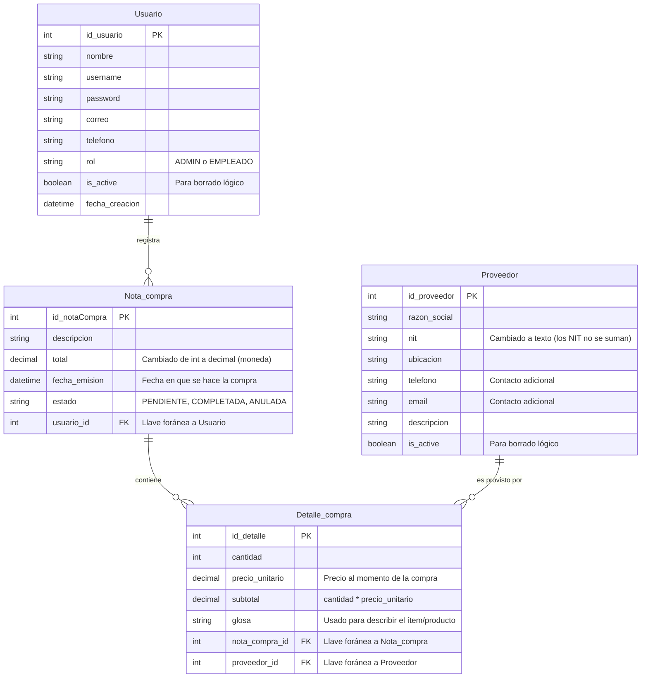

# Esquema de Base de Datos

De acuerdo a la imagen que enviaste y tu descripción, he mapeado las 4 tablas, **agregando los atributos recomendados para robustecer el sistema** y corrigiendo la consistencia de los tipos de datos (por ejemplo, el NIT debe ser texto, y los campos monetarios deben ser decimales).

Tenemos una relación de "Uno a Muchos" entre `Usuario` y `Nota_compra`. Luego, tenemos una relación de "Muchos a Muchos" entre `Nota_compra` y `Proveedor`, la cual se rompe utilizando la tabla intermedia (asociativa) llamada `Detalle_compra`.

Aquí tienes el diagrama actualizado:

## Detalles de Consistencia
1. **NIT:** En tu diagrama original estaba como `int`. En bases de datos de producción, documentos de identidad o NITs siempre son de tipo `String/Varchar` porque pueden llevar ceros a la izquierda y no se realizan operaciones matemáticas con ellos.
2. **Moneda (`total`, `precio_unitario`, `subtotal`):** Se ajustaron a tipo `Decimal` en lugar de `int` o `float`. El tipo decimal previene errores de redondeo en operaciones financieras.
3. **Borrado Lógico (`is_active`):** En lugar de borrar usuarios o proveedores, se cambia este estado a `falso` para mantener el historial de compras intacto en la base de datos.
