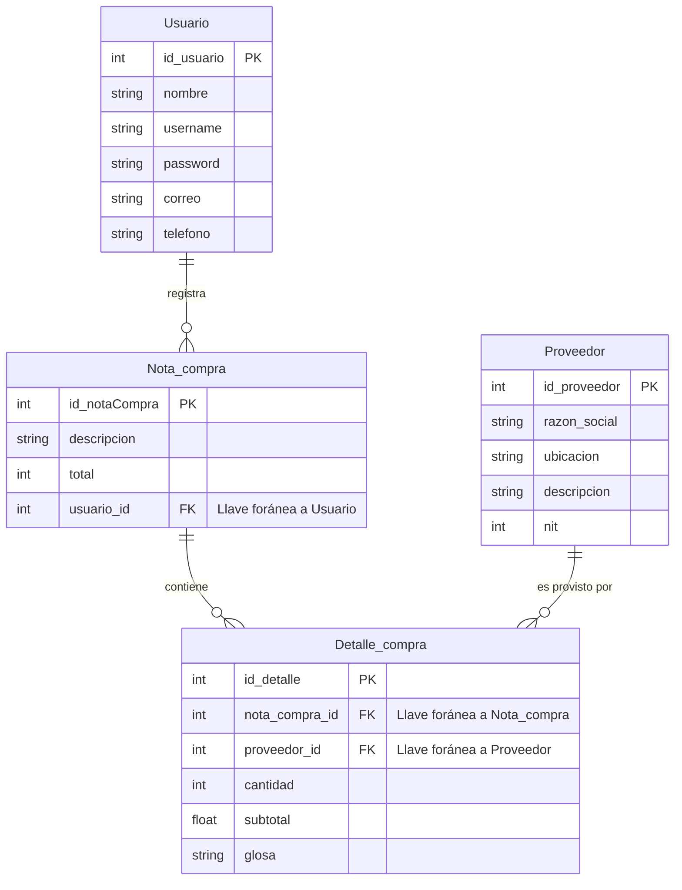

# Esquema de Base de Datos

De acuerdo a la imagen que enviaste y tu descripción, he mapeado las 4 tablas. Tenemos una relación de "Uno a Muchos" entre `Usuario` y `Nota_compra`. Luego, tenemos una relación de "Muchos a Muchos" entre `Nota_compra` y `Proveedor`, la cual se rompe utilizando la tabla intermedia (asociativa) llamada `Detalle_compra`.

Aquí tienes el diagrama mapeado para que lo puedas visualizar correctamente:

